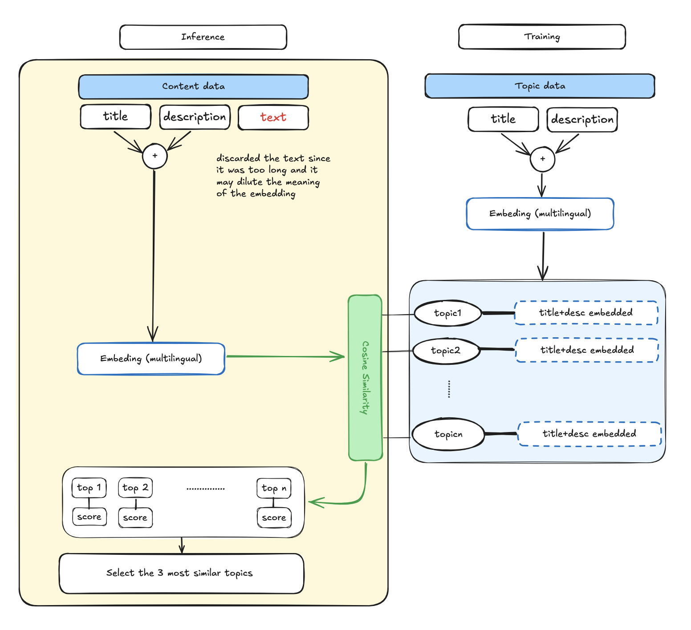
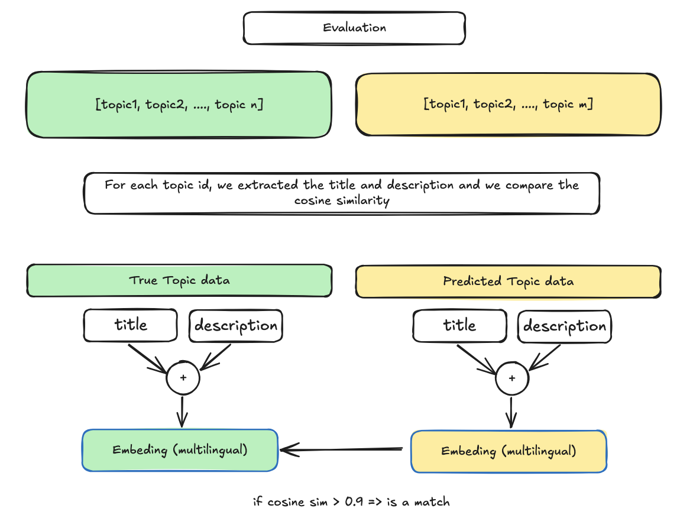

# topic-pred

## Solution

Content-to-Topic prediction system for K-12 educational materials using semantic embeddings.

### Overview of Approach



This solution uses a **semantic embedding similarity approach** to match content to topics:

1. **Text Preprocessing**: Content titles and descriptions are concatenated and cleaned
2. **Embedding Generation**: Uses `paraphrase-multilingual-MiniLM-L12-v2` sentence transformer to encode both content and topics into dense vector representations
3. **Similarity Matching**: Computes cosine similarity between content and topic embeddings
4. **Filtering & Ranking**: Returns top-k topics (default k=3) with similarity scores above threshold (default 0.3)

**Rationale**: Embedding-based approaches capture semantic meaning effectively and generalize well to new content without requiring extensive training data. The multilingual model ensures robustness across varied educational content.



**Metrics**: since the topics were duplicated, and sometimes we might predict the correct topic but not the correct id. I opted for establish a match if the cosine similarity is greater than 0.9

### Code Access Point

- First you need to download the data in the 'data' folder (find them in https://www.kaggle.com/competitions/learning-equality-curriculum-recommendations.). 3 files are needed:
  - `content.csv`
  - `correlations.csv`
  - `topics.csv`

- Run the notebook `topic_prediction_training_refactored.ipynb`
  - Notebook contains full pipeline: data loading, preprocessing, model training, and artifact generation
  - Run cells sequentially from top to bottom to regenerate artifacts

**For predictions**:
- `predict_template.py` → `TopicPredictor` class (it is only using `title` and `description` fields)
- Uses pre-generated artifacts in `artifacts/topic_predictor_direct_model.pkl`

**Supporting utilities**:
- `preprocess_methods.py`: Text preprocessing and embedding generation
- `predict_method.py`: Core prediction logic using cosine similarity
- `io.py`: Data loading helpers
- `defaults.py`: Configuration constants


## Metrics

| Metric | Score |
|--------|-------|
| Recall | 0.2638 |
| Precision | 0.1655 |
| F1-Score | 0.2034 |


*Note: Metrics computed on validation set using correlations.csv as ground truth. Remember that a match is the combined_text similarity greater than 0.9 between pred and true values*

## What Would You Have Done With More Time?

1. **Hybrid Approach**: Combine semantic embeddings with metadata features (content_kind, topic_category, keywords) using a learned weighting scheme
2. **Fine-tuning**: Domain-adapt the sentence transformer on K-12 educational corpus
3. **Evaluation**: More comprehensive metrics including NDCG, MAP, and per-category performance analysis
4. **Data Augmentation**: Leverage topic hierarchies and content language fields for improved matching


Quick start

1. Create a virtual environment and install dependencies (python <=3.12):

```bash
python -m venv .venv
source .venv/bin/activate
pip install -r requirements.txt
```


Compatibility note
------------------

Some binary packages (notably PyTorch) are compiled against specific NumPy ABI versions. If you see errors like

```
RuntimeError: Numpy is not available
```

or messages about a module compiled with NumPy 1.x not running with NumPy 2.x, pin NumPy to a 1.x release before installing other packages:

```bash
# from project root
python -m venv .venv
source .venv/bin/activate
python -m pip install --upgrade pip
python -m pip install "numpy<2,>=1.21"
python -m pip install -r requirements.txt
```

This ensures binary compatibility between PyTorch and NumPy. The `requirements.txt` in this repository already pins NumPy to `<2`.
